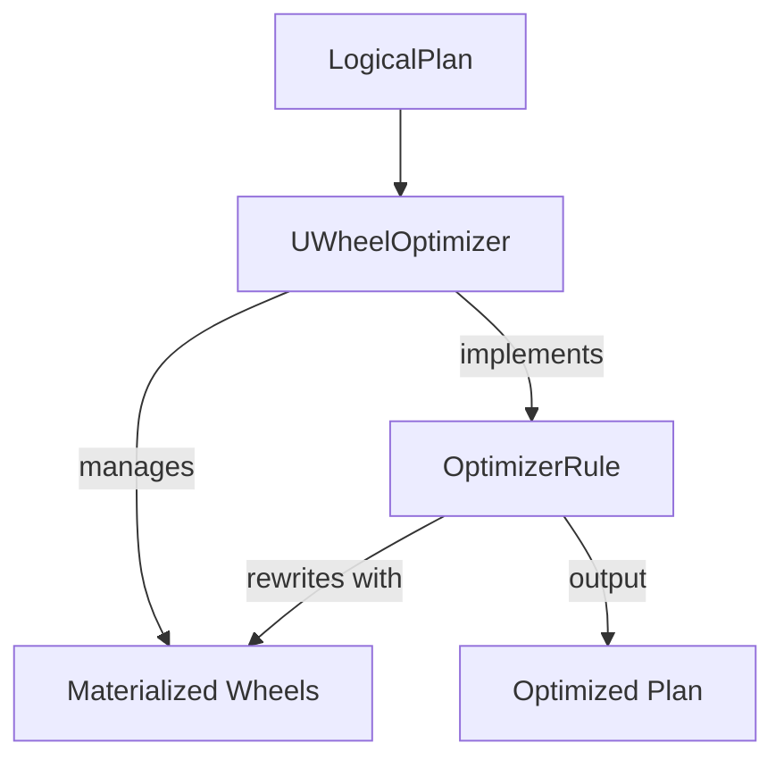

# datafusion-uwheel

``datafusion-uwheel`` is a Datafusion query optimizer that indexes data using [µWheel](https://uwheel.rs) to accelerate query processing. The motivation behind this work is based on the following [post](https://uwheel.rs/post/datafusion/).

See the following tracking [issue](https://github.com/uwheel/datafusion-uwheel/issues/1) for progress. Note that this project is still in the early stages of development.

## Architecture

The following diagram shows the high-level architecture of ``datafusion-uwheel``.

