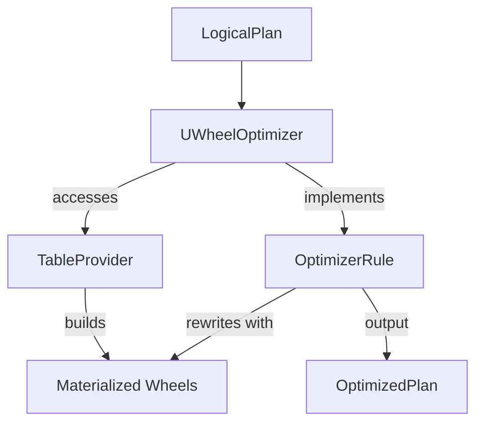

# datafusion-uwheel

``datafusion-uwheel`` is a Datafusion query optimizer that indexes data using [µWheel](https://uwheel.rs) to accelerate query processing. The motivation behind this work is based on the following [post](https://uwheel.rs/post/datafusion/).

See the following tracking [issue](https://github.com/uwheel/datafusion-uwheel/issues/1) for progress. Note that this project is still in the early stages of development.

## Architecture

The following diagram shows the high-level architecture of ``datafusion-uwheel``.



## Preliminary Results

The following results are based on the [nyc_taxi_bench](benchmarks/nyc_taxi_bench) and were executed on a Macbook Pro M2.

Note that the performance and storage requirements of wheel indices depends on several factors.
The space usage depends on the aggregate type and whether the index stores aggregates at all time dimensions (seconds, minutes, hours, days, weeks, years).
Also, if the index uses prefix-enabled wheels it requires more space but enables faster performance.

The wheel indices used in the benchmarks are configured to store aggregates at all time dimensions,
leading to a higher space usage but also enabling faster query performance for a large range of temporal queries.

### COUNT(*) Aggregation

```sql
SELECT COUNT(*) FROM yellow_tripdata \
WHERE tpep_dropoff_datetime >= '{}' \
AND tpep_dropoff_datetime < '{}'",
```

| System     | p50 | p99 | p99.9 |
| ---------- | --- | --- | --- |
| datafusion (Second Ranges) | 49529µs | 53889µs | 587295µs |
| datafusion (Minute Ranges) | 49623µs | 50751µs | 51799µs |
| datafusion-uwheel (Second Ranges)    | **59µs**   | **99µs**   | **263µs**   |
| datafusion-uwheel (Minute Ranges)    | **54µs**   | **92µs**   | **208µs**   |

The optimizer significantly reduces query latencies by using a Count wheel index that is configured
with prefix-enabled wheels enabling any range to be queried in constant time.

**Index size usage:** 20.8 MiB

### Keyed SUM Aggregation

```sql
SELECT SUM(fare_amount) FROM yellow_tripdata \
WHERE tpep_dropoff_datetime >= '{}' \
AND tpep_dropoff_datetime < '{}'
AND passenger_count = 3.0",
```

This index is built through the following API code:

```rust
optimizer
  .build_index(
    IndexBuilder::with_col_and_aggregate(
      "fare_amount",
      AggregateType::Sum,
    )
    .with_filter(col("passenger_count").eq(lit(3.0)))
   ).await?;
```

| System     | p50 | p99 | p99.9 |
| ---------- | --- | --- | --- |
| datafusion (Second Ranges) | 72447µs | 76971µs | 80787µs |
| datafusion (Minute Ranges) | 72355µs | 73319µs | 76159µs |
| datafusion-uwheel (Second Ranges)    | **62µs**   | **74µs**   | **256µs**   |
| datafusion-uwheel (Minute Ranges)    | **65µs**   | **84µs**   | **165µs**   |

**Index size usage:** 41.6 MiB

### MinMax Filtering

```sql
SELECT * FROM yellow_tripdata \
WHERE tpep_dropoff_datetime >= '{}' \
AND tpep_dropoff_datetime < '{}'
AND fare_amount > {}",
```

| System     | p50 | p99 | p99.9 |
| ---------- | --- | --- | --- |
| datafusion (Second Ranges) | 242103µs | 246999µs | 251527µs |
| datafusion (Minute Ranges) | 242151µs | 246935µs | 255415µs |
| datafusion-uwheel (Second Ranges)    | **1272µs**   | 247511µs | 249471µs  |
| datafusion-uwheel (Minute Ranges)    | **1258µs**   | 248783µs   | 253695µs   |

As seen by the p50 latency, the optimizer is able to skip query processing on certain temporal ranges and fare amounts
through the use of MinMax wheel indices.

**Index size usage:** 41.6 MiB
